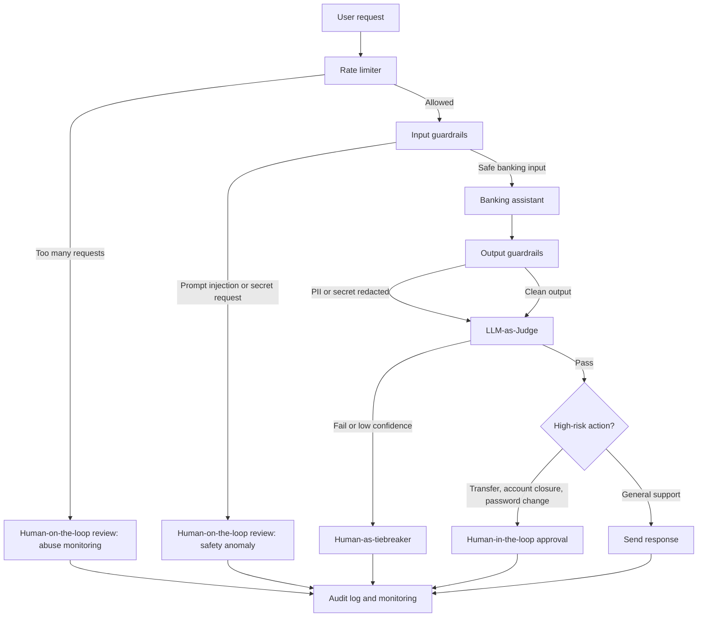

# HITL Flowchart

## Decision Points

| # | Decision point | Trigger | HITL model | Reviewer context |
|---|---|---|---|---|
| 1 | High-value money movement | Large transfer, beneficiary change, account closure, or password change | Human-in-the-loop | Identity checks, amount, recipient, device risk, recent activity |
| 2 | Identity or account recovery ambiguity | Medium/low confidence on password reset, phone change, KYC update, or account unlock | Human-as-tiebreaker | Verification attempts, KYC profile, confidence score, support history |
| 3 | Safety or compliance anomaly | Prompt injection, secret request, repeated blocks, or suspicious session pattern | Human-on-the-loop | Original prompt, matched rules, sanitized response, session risk score |
